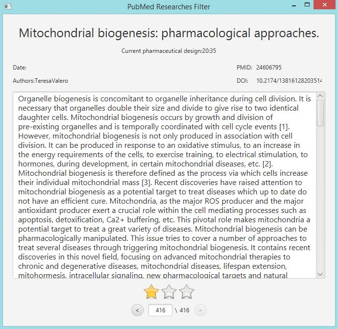

# PubMedResearchesFilter
Simple software to classify PubMed researches resulted from searching according to their relevance to the review you are writing
## When I need it
When you write a scientific review you must start with searching about the review subject and collecting researches. Then you should start reading and classifing them according to their relevance to your review. This process can be made easy with this software especially with fetching articles abstract and text for free from sci-hub.
## How to use

When you are finished from your PubMed search you can download them using PMID formate from download options. Change the file name to pmids.csv and save it inside the software bin directory and start PubMedResearchesFilter.bat file. The software will open and start fetching article info from PubMed and present it to you. You can rate the article and write your notes for every article. Also, by clicking on the article name the software will open sci-hub website to view the full article pdf file.